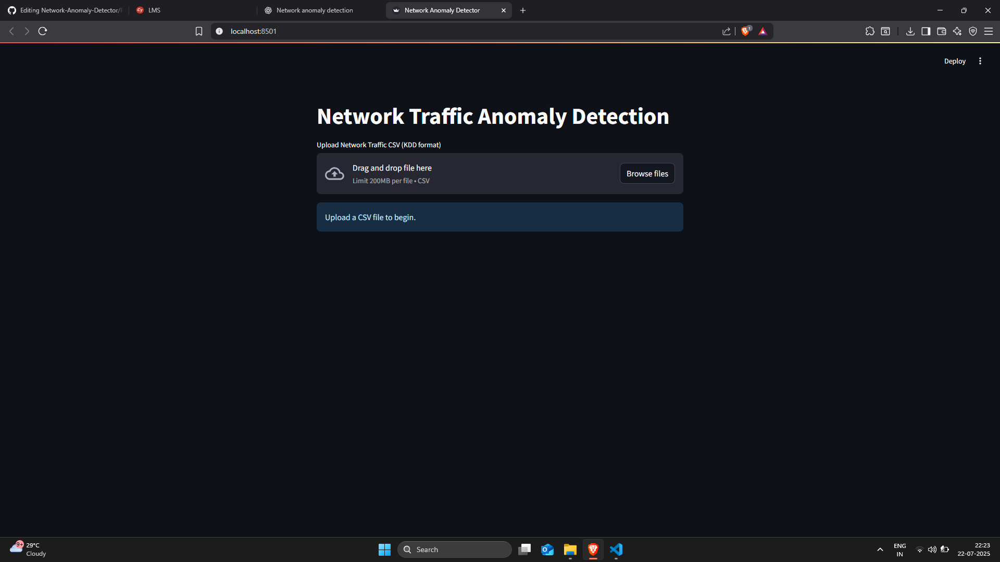

## 📚 Dataset Source

This project uses a well-known dataset for network intrusion detection:

- **KDD Cup 1999 Dataset**  
  📂 [Download from Kaggle](https://www.kaggle.com/datasets/galaxyh/kdd-cup-1999-data)

You can explore and download the dataset from the link above. It contains simulated network traffic, labeled with normal and various attack types (e.g., DoS, Probe, R2L, U2R), and is widely used for benchmarking anomaly detection systems.

# 🕵️‍♂️ Network Anomaly Detector

This project is a Python-based web app for detecting anomalies in network traffic data using unsupervised machine learning techniques. It helps identify unusual patterns that may indicate security breaches, intrusions, or system malfunctions.



---

## 🚀 Features

- 📊 Load and preview CSV network data
- 🧼 Automatic preprocessing and scaling
- 🧠 Anomaly detection using Isolation Forest (Autoencoder can be added)
- 🔍 Identify and list suspicious activity
- 🌡️ Heatmap and correlation visualization
- 💾 Export labeled results as CSV
- ⚙️ Configurable model settings in `config.py`

---

## 📁 Project Structure

- `app.py` - Main application entry point
- `config.py` - Configuration settings
- `models.py` - Machine learning models
- `preprocessing.py` - Data preprocessing utilities
- `utils.py` - Helper functions
- `sample.csv` - Example network data
#### Note : Sample Data are in the ZIP File ( Large data sized ). Extract the data and save it into the same folder.
- `requirements.txt` - Python dependencies

## Setup
1. **Clone the repository:**
   ```bash
   git clone <repository-url>
   cd Network-Anomaly-Detector
   ```
2. **Create and activate a virtual environment (optional but recommended):**
   ```bash
   python3 -m venv venv
   source venv/bin/activate
   ```
3. **Install dependencies:**
   ```bash
   pip install -r requirements.txt
   ```

## Usage
1. Place your network data in CSV format (see `sample.csv` for an example).
2. Run the main application:
   ```bash
   streamlit run app.py 
   ```
3. Follow the prompts or configure settings in `config.py` as needed.

https://github.com/user-attachments/assets/a2474706-64fe-47f5-84c3-689a11d20f21
